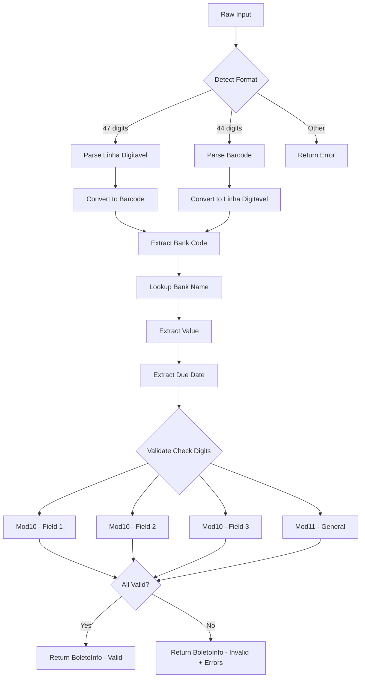
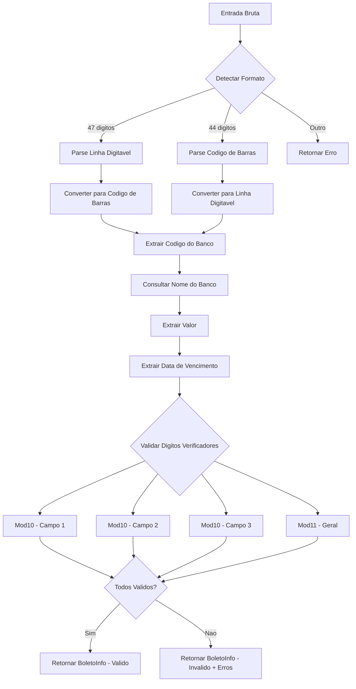

# Brazilian Boleto Authenticator Service / Servico Autenticador de Boletos Bancarios

## English

### About the Project

This project implements a service for validation and authentication of Brazilian boleto bancario (bank payment slips). It parses and validates both the 47-digit "linha digitavel" (typed line) and 44-digit barcode formats, verifying check digits using Mod10 and Mod11 algorithms, identifying issuing banks, and extracting payment information such as value and due date.

### Validation Flow



### Architecture

```
azure-boleto-authenticator-service/
|-- src/
|   |-- boleto/
|   |   |-- __init__.py        # Module exports
|   |   |-- bank_codes.py      # Bank code to name mapping
|   |   |-- models.py          # BoletoInfo dataclass
|   |   |-- parser.py          # Linha digitavel and barcode parser
|   |   |-- validator.py       # Mod10 and Mod11 validation
|-- tests/
|   |-- test_validator.py      # 20+ unit tests
|-- main.py                    # Demo script
|-- requirements.txt
|-- .gitignore
|-- README.md
```

### Key Features

- Parse 47-digit linha digitavel format
- Parse 44-digit barcode format
- Bidirectional conversion between formats
- Mod10 check digit validation (Fields 1, 2, 3)
- Mod11 check digit validation (General barcode check)
- Bank code identification (35+ Brazilian banks)
- Value and due date extraction
- Comprehensive error reporting

### Supported Banks

| Code | Bank |
|------|------|
| 001 | Banco do Brasil |
| 033 | Santander |
| 104 | Caixa Economica Federal |
| 237 | Bradesco |
| 341 | Itau Unibanco |
| 756 | Sicoob |

And 30+ additional institutions.

### How to Run

```bash
# Clone the repository
git clone https://github.com/galafis/azure-boleto-authenticator-service.git
cd azure-boleto-authenticator-service

# Install dependencies
pip install -r requirements.txt

# Run the demo
python main.py

# Run tests
pytest tests/ -v
```

### Technologies

| Technology | Purpose |
|---|---|
| Python 3.10+ | Core language |
| pytest | Testing framework |
| dataclasses | Data models |

---

## Portugues

### Sobre o Projeto

Este projeto implementa um servico para validacao e autenticacao de boletos bancarios brasileiros. Ele faz o parsing e a validacao dos formatos de 47 digitos (linha digitavel) e 44 digitos (codigo de barras), verificando digitos verificadores usando os algoritmos Mod10 e Mod11, identificando bancos emissores e extraindo informacoes de pagamento como valor e data de vencimento.

### Fluxo de Validacao



### Funcionalidades Principais

- Parse do formato de 47 digitos (linha digitavel)
- Parse do formato de 44 digitos (codigo de barras)
- Conversao bidirecional entre formatos
- Validacao de digito verificador Mod10 (Campos 1, 2 e 3)
- Validacao de digito verificador Mod11 (Verificacao geral do codigo de barras)
- Identificacao de bancos por codigo (35+ bancos brasileiros)
- Extracao de valor e data de vencimento
- Relatorio completo de erros

### Como Executar

```bash
# Clonar o repositorio
git clone https://github.com/galafis/azure-boleto-authenticator-service.git
cd azure-boleto-authenticator-service

# Instalar dependencias
pip install -r requirements.txt

# Executar o demo
python main.py

# Executar os testes
pytest tests/ -v
```

### Tecnologias Utilizadas

| Tecnologia | Finalidade |
|---|---|
| Python 3.10+ | Linguagem principal |
| pytest | Framework de testes |
| dataclasses | Modelos de dados |

### Referencia

- [Documentacao Azure Functions](https://learn.microsoft.com/azure/azure-functions/)
- [Especificacao Boleto Bancario - FEBRABAN](https://portal.febraban.org.br/)

## Autor / Author

**Gabriel Demetrios Lafis**
